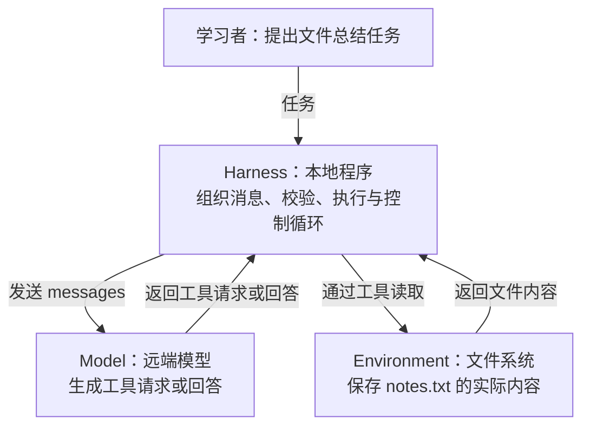
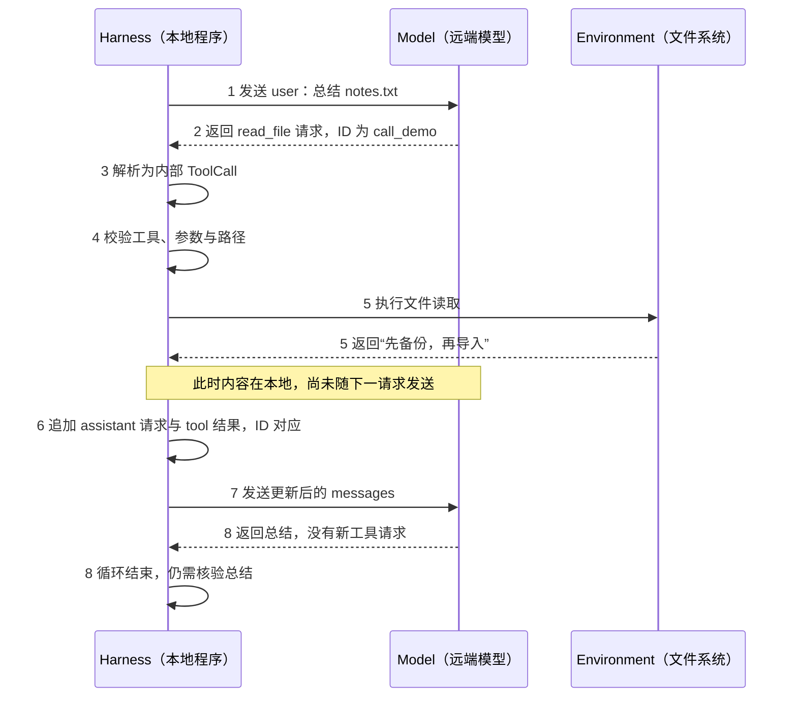

# 桥接课 · 把 01–04 章连成一次完整行动

> 用途：已有单点知识，但说不清它们如何配合时，由导师带读相关片段。不新增考试，不重置进度。
> 状态：依据现有源码的讲解与合成示范；不是本次新运行的记录，也不新增 Agent 功能。
> 当前只看：导师先用图 1 定位角色，再带读图 2 的一个片段；其余内容由卡点决定是否展开。不是要求一次读完全部图表。

## 1. 为什么不能只让模型回答

任务：总结 `sandbox/notes.txt`。模型不因为看到文件名就自动知道本机文件内容。本课现有 `read_file` 工具由应用执行；模型提出请求，Harness 决定是否执行、如何把结果带回下一次请求。

### 图 1 · 先认清谁负责什么

**看图目的：** 找到“谁提出行动”和“谁真正接触文件”，不是背组件名称。这是一张本课职责示意图，不表示完整架构或真实运行记录。矩形是参与者，箭头标签说明传递什么。



**导师带读：** 先只看 Model 与 Harness 之间的两根箭头：返回 `read_file` 请求，不等于文件已经读到。再看 Harness 与文件系统之间的箭头：真正读取发生在本地工具执行时。图中没有“模型直接读取本机文件”的连接。

三层职责：**Model 提议；Harness 组织、检查、控制；Environment 真正保存文件和产生影响。** 这里是本课程的实现分工，不要求背定义，而要在链条上找到具体动作。

### 图 2 · 同一份文件内容什么时候进入下一次请求

下面用一个**合成示范**走完整链。假设文件内容是“先备份，再导入”。示意 ID `call_demo` 不是实际运行记录。

**读图方法：** 从上往下是时间；三列是三个参与者；实线表示发起请求或本地动作，虚线表示返回。先看 1–5，再看 6–8，不必一次记住所有箭头。



**沿图讲解：** 1–5 解释本地如何获得文件；6–7 解释结果如何进入模型下一次可用的上下文；8 解释为什么程序可以停止，但总结是否正确还要对照文件。先讲通这一条正常路径，再讨论预算或重复调用，不把所有分支塞进同一张图。

**把图落到代码：** 图中 3 对应 `src/model.ts` 的 `parseChatResponse` / `readToolCalls`；4–5 对应 `src/tools.ts` 的 `checkToolCall` / `executeToolCall`；6–7 对应 `src/cli.ts` 中追加 `messages` 并发起下一轮请求的路径。图不是额外要背的材料，而是定位代码和解释输出的索引。

<details>
<summary>需要查字段时再展开：步骤、数据与代码对照</summary>

| 时刻 | 数据/动作 | 谁负责，为什么需要它 |
|---|---|---|
| 1 | `user`：总结这个文件 | Harness 组装 `messages`，形成模型本轮能看到的上下文 |
| 2 | 请求 `read_file`，参数文本为 `{"path":"notes.txt"}`，ID 为 `call_demo` | 模型返回行动建议；此刻文件还没有被读 |
| 3 | 解析为内部 `ToolCall` | `src/model.ts` 的 `parseChatResponse` / `readToolCalls` 把服务端形状转成应用形状 |
| 4 | 检查工具名、JSON、字段及路径 | `src/tools.ts` 的 `checkToolCall` 决定请求是否可执行；描述工具不等于授予权限 |
| 5 | 读取文件，得到“先备份，再导入” | `executeToolCall` 与文件系统发生交互；结果先在本地，不会自动出现在模型脑中 |
| 6 | 追加 assistant 的工具请求，以及带同一 ID 的 tool 结果 | `src/cli.ts` 的 `messages.push(...)` 保留请求与结果的关系；只打印到终端不等于回填 |
| 7 | 携带更新后的 `messages` 再请求模型 | 模型这时才能依据工具结果作答；下一轮不是凭空记住本地变量 |
| 8 | 没有新工具请求，当前 Loop 结束 | 这是程序的停止条件；总结是否忠实仍需对照文件，不能只看“结束” |

</details>

代码中的重复调用策略与步数预算还可能提前停止。上述示范假设预算足够、无重复停止、请求合法。当前 `sandbox/` 只是工具约束下的练习目录，不等于系统级隔离；符号链接与执行隔离在 06–07 章深化。

## 2. 一个有依据的小变化

**为什么问：** 排查“终端明明读到了文件，模型却说不知道”时，分清本地观察与模型上下文。

**已知条件：** 文件读取成功，内容只打印到了终端；发送给模型的下一次 `messages` 没有请求和工具结果；没有其他渠道提供文件内容。

**问题：** 此时能否说模型已经收到文件内容？只需指出链条中缺少的动作。这是根据给定数据流推导，不是猜模型将输出哪句话。可以沿图 2 指出动作，无需重画整张图或背出全部字段。

需要帮助时先定位图 2 的 5–7；还不清楚时导师完整对比有回填/无回填两条路径，不要求反复猜。若示范已揭示关键答案，本次只记录有支持的判断，不当成独立迁移证据。

<details>
<summary>练习后对照解释</summary>

不能说已经收到。文件内容出现在终端，仅能说明本地拿到了结果；本例缺少将请求与结果写入后续消息并发送的动作。模型可能猜对内容，但猜对不能证明发生了传递。这个结论依赖题目明确排除了其他信息渠道。

</details>

## 3. 如何回查真实材料

既有参考：`fixtures/ch03/loop-after.json`、`fixtures/ch03/loop-after-round2.json`；定位第二轮 request.messages 中 assistant/tool 结构。它们是历史文件，不是本次新调用结果。

已有离线命令：

```bash
node src/cli.ts replay fixtures/ch03/loop-after-round2.json
```

当前 `replay` 只解析单份保存的响应并展示记录，不重跑工具或完整 Loop，不证明现有文件内容与录制时相同。需要检查是否回填，应查看保存的 request.messages 与源码；需要验证当前完整交互，另做有预算的真实运行或以后实现的完整离线测试。

## 4. 进入 04.2 前只建立这一条连接

服务端响应经适配层变为程序可见状态；**丢掉一个字段，后面的代码就可能失去做某种判断的依据**。04.1 看“保留了什么、丢了什么”；04.2 看丢失停止原因会怎样影响截断判断。不是为了记住一个英文参数，而是为了不把缺少证据的输出当成可靠结果。

分清四件事：HTTP 请求成功、模型生成结束、程序循环停止、真实任务完成。它们有联系，但不能相互替代。
