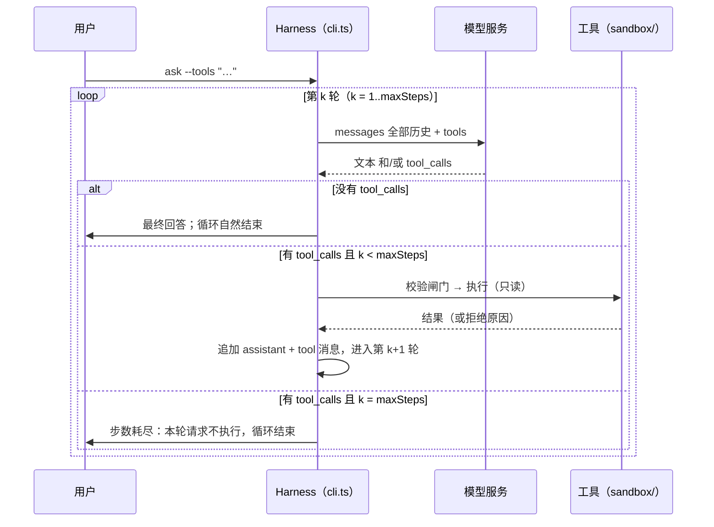

# 03.2 · 有界循环

> **本步问题**：固定跑两轮的流程，怎样变成"由观察决定何时停"的循环——又为什么必须给它加一个上限？
> **前置**：03.1 工具结果回填与调用 ID 关联（同目录讲义）；02.3 校验闸门（被拒绝的调用也要回填）。
> **蓝图对应**：第 03 章 Agent Loop（如何根据观察继续行动？）。

## 1. 目标与可观察任务

03.1 之后，系统能在同一进程里跑两轮：请求工具 → 执行 → 回填 → 再问一次。但轮数是写死的，第二轮之后再要工具就不管了。

本步把它推广成一个**有界循环**：

- **循环**：每一轮把当前完整历史 `messages` 发给模型。响应里有 `tool_calls` → 校验、执行、回填，进入下一轮；没有 `tool_calls` → 循环自然结束，模型这一轮的文本就是最终回答。
- **上限**：`--max-steps N`（默认 8），**一次模型请求算一步**。用尽时明确报告：不执行这一轮的工具请求，也不再发下一次请求。
- **观察点**：每轮打印 messages 构成与本轮用量；同一次工具调用再次出现时标注"← 与第 k 轮相同（重复调用）"（本步只标记，不处理——留给 03.3）。

运行时可以观察到：一个任务跨 3 轮完成；`messages` 条数逐轮增加；累计输入 token 的增长快于输出。

## 2. 原理与执行轨迹

循环每一轮做的事情完全相同——"带上全部历史问模型"，差异只在于历史越来越长：



两个出口：

| 出口 | 条件 | Harness 行为 |
|---|---|---|
| 自然结束 | 某轮响应没有 `tool_calls` | 打印该轮文本作为最终回答 |
| 步数耗尽 | 第 `maxSteps` 轮响应仍有 `tool_calls` | 列出未执行的请求；不执行、不再请求 |

**为什么"模型会自己停"还不够。** 模型确实常常在信息够了以后停止请求工具（下面的运行就能看到），但它没有"预算"概念：可能重复同一个调用、可能在两个文件之间来回读、可能因为参数总是不对而反复重试。轮数直接对应时间和 API 费用，而每一轮都重发全部历史（03.1 的用量证据：364 → 465 tokens），成本随轮数超线性增长。有界循环先保证"一定会停、停下时有明确原因"；更细的治理（取消、停滞检测、权限）属于第 08、09、17 章。

**为什么耗尽时"不执行"最后那轮请求。** 执行结果本来要回填给模型，但已经没有下一轮预算——结果没人消费。对只读工具这只是浪费；对 06 章之后的写工具，就是无人看见的副作用。这条选择提前体现了第 08 章的原则：取消之后不再启动新工具。

> 类比与边界：这个过程像"每做一小步就看一眼结果、再决定下一步"的同事。区别是同事会累、会主动喊停，模型不会——"停"必须由 Harness 的代码保证，模型只负责在信息足够时不再请求工具。

## 3. 实现与差异导读

改动集中在 `src/cli.ts`：

- `src/cli.ts:7` 新增 `DEFAULT_MAX_STEPS = 8`；`src/cli.ts:51` 解析 `--max-steps`，非正整数直接拒绝（退出码 2）。
- ask 从"两轮写死"改为循环（`src/cli.ts:111`）：`messages` 在循环外创建、逐轮累加；`requestRound`（`src/cli.ts:97`）负责发送、录制、解析，出错时用 `withStep`（`src/cli.ts:266`）标注"第 k 轮"，01.2 定下的 HTTP 错误码分类保持不变。
- 循环体固定顺序：打印本轮 messages 摘要 → 请求 → 打印文本与用量 → 判定出口 → 执行工具并回填（`src/cli.ts:161`）。
  - 摘要由 `describeMessages`（`src/cli.ts:248`）生成，形如 `user(36 字符) + assistant(文本 0 字符 + 1 个工具请求) + tool(回填 76 字符，id=call_00_k9LY…)`。
  - 重复调用标记（`src/cli.ts:132`）：以 `工具名(参数原文)` 为签名记录首次出现的轮次，再次出现时在该行追加标记。
  - 结束报告：跑了多少步、上限多少、累计输入/输出 tokens、停止原因（自然结束 / 步数耗尽）。
- 录制泛化：第 1 轮到 `<名字>.json`，第 k（k≥2）轮到 `<名字>-round<k>.json`。
- `replay` 增加一行原请求 messages 摘要（`src/cli.ts:188`），离线也能看到"回填后的请求长什么样"。

## 4. 验证

真实运行 A（正常多步，有费用）：

```bash
node src/cli.ts ask --tools --record fixtures/chat-2026-09-15-loop-multistep.json \
  "先列出 sandbox/ 里有哪些文件，再读取 todo.md，然后用一句话总结待办内容"
```

预期观察：至少 3 轮；第 1 轮 `list_files`、第 2 轮 `read_file`、第 3 轮没有工具请求；结束原因打印"自然结束"。

**预测题（先写下判断，再运行）**：

```bash
node src/cli.ts ask --tools --max-steps 1 "读取 notes.txt 并总结"
```

问题：第 1 轮模型会怎么响应？`notes.txt` 会被真正读取吗？进程最后打印什么、以什么方式结束？

离线回放（免费，不执行工具、不联网）：

```bash
node src/cli.ts replay fixtures/chat-2026-09-15-loop-multistep-round2.json
```

失败路径：步数耗尽（上面的预测题命令）。另外有一条离线的参数校验路径：`node src/cli.ts ask --max-steps 0 "x"` → 退出码 2。

## 5. 验证记录（课后回填）

**真实运行 A：多步任务（2026-09-15，控制台输出原文摘录）**

```text
【第 1 轮请求】messages 共 1 条：user(44 字符)
【真实调用·第 1 轮】耗时 4353 ms；本轮用量：输入 369 + 输出 34 = 403 tokens
模型请求调用工具：
  - list_files（id=call_00_ET_OMdDrYF86wB5uOLfyKSX1151）参数原文：{}
--- list_files：执行结果 ---（3 个文件）

【第 2 轮请求】messages 共 3 条：user(44 字符) + assistant(文本 57 字符 + 1 个工具请求) + tool(回填 29 字符，id=call_00_ET_O…)
【真实调用·第 2 轮】耗时 2872 ms；本轮用量：输入 424 + 输出 52 = 476 tokens
  - read_file（id=call_00_Gh2QjzaPEVcbwEzbbrA07283）参数原文：{"path": "todo.md"}
--- read_file：执行结果 ---（待办三条）

【第 3 轮请求】messages 共 5 条：user(44 字符) + assistant(57 字符 + 1 个工具请求) + tool(29 字符) + assistant(33 字符 + 1 个工具请求) + tool(85 字符)
【真实调用·第 3 轮】耗时 2098 ms；本轮用量：输入 549 + 输出 81 = 630 tokens
模型没有再请求工具 —— 循环在第 3 轮自然结束。
【结果】跑了 3 步（上限 8）；累计输入 1342 + 输出 167 tokens
```

要点：计划预期的"3 轮、一轮一个工具"与本次运行一致；每轮输入都在涨（369 → 424 → 549）——历史重发的代价可见。fixtures：`chat-2026-09-15-loop-multistep-alt.json`、`…-alt-round2.json`、`…-alt-round3.json`。

另一次同任务的收录运行（由学习者亲手执行，fixtures `chat-2026-09-15-loop-multistep.json`、`…-round2.json`、`…-round3.json`）形状相同：3 轮、每轮一个工具，累计输入 1328 + 输出 153。

**行为方差（同任务另一次运行）**：出现过 **2 轮**完成的情况——模型在第 1 轮同时请求 `list_files` 与 `read_file`（该次录制被后一次同路径运行覆盖，仓库未保留）。轮数与每轮工具个数是**模型行为**，不是协议保证；多工具并行到达的处理在 03.3 专门验证。

**离线回放**：`node src/cli.ts replay fixtures/chat-2026-09-15-loop-multistep-round2.json` → 原请求 messages 共 3 条，能看到回填后的请求形状（tool 消息与 id 前缀）。

**真实运行 B：步数耗尽（2026-09-15，实际输出摘录）**

```bash
node src/cli.ts ask --tools --max-steps 1 --record fixtures/chat-2026-09-15-loop-maxsteps.json \
  "读取 notes.txt 并总结"
```

```text
【第 1 轮请求】messages 共 1 条：user(16 字符)
【真实调用·第 1 轮】耗时 2406 ms；本轮用量：输入 354 + 输出 46 = 400 tokens
模型请求调用工具：
  - read_file（id=call_00_ET_wh0IaydUti93yVNoikNO3077）参数原文：{"path": "notes.txt"}

步数上限 1 已用尽：本轮的 1 个工具请求不执行，也不再发起下一轮请求。
【结果】跑了 1 步（上限 1）；累计输入 354 + 输出 46 tokens
停止原因：步数耗尽——模型仍有未执行的工具请求（上方已列出）。
```

要点：`read_file` 请求**到达了 Harness 但没有被执行**——不是"没来得及"，而是到达上限后的明确选择（执行了也无法回填）。进程以**退出码 0** 正常结束：这是一次"按预算停住并如实报告"的运行，不是崩溃。fixture：`fixtures/chat-2026-09-15-loop-maxsteps.json`。

## 6. 小结

循环让模型按观察决定轮数，上限保证 Harness 一定停下并说明原因。下一步（03.3）处理循环里暴露的两种模型行为：重复调用与一次请求多个工具。
