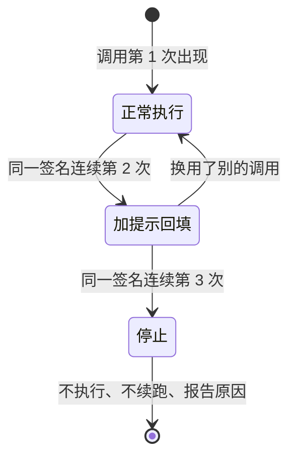

# 03.4 · 重复调用与分级处理

> **本步问题**：同一个调用被反复请求时，Harness 应该怎么办——"有明确结果"具体是什么？
> **前置**：03.2 的重复标记（只观察）；03.3 多工具与 id 语义。
> **蓝图对应**：第 03 章 Agent Loop（"重复调用有明确结果"是本章验收点之一）。

## 1. 目标与可观察任务

本步采用**分级处理**（来自本步的设计讨论，实现时细化了阈值与"连续"的定义）：

| 同一签名连续出现 | 动作 | 运行时可见 |
|---|---|---|
| 第 1 次 | 正常执行 | 常规输出 |
| 第 2 次 | 执行 + 回填时加提示 | 结果前缀"（提示：本次调用与第 k 轮完全相同）" |
| 第 3 次起 | 不执行、记录说明、结束循环 | 打印停止原因；说明留在转录与输出里 |

- 签名 = 工具名 + 参数原文；**"连续" = 与上一次调用相邻**（中间没有别的调用）。这样 `read → edit → read` 这类合法重读不会误伤——06 章有写工具之后尤其重要。
- 为什么分级而不是单点：两块防线防的不是同一件事——**提示**防"模型没意识到自己在重复"（便宜，保留自我纠偏机会）；**停止**防"提示无效、还在烧预算"（硬止损）。只做前者挡不住卡死；只做后者会误伤有意重读。
- 停止轮的"回填"**到不了模型**（没有下一轮请求）：它作为转录记录留给人和后续功能。要让模型看到，需要额外一次收尾请求——代价是多一步预算（课后变体）。
- 步数上限（03.2）仍是最后防线：重复防护是它前面更早、更便宜的一道。

## 2. 原理与执行轨迹



## 3. 实现与差异导读

- `src/cli.ts:92`：维护 `firstSeenStep`（签名 → 首次轮次）与 `lastSignature` / `repeatStreak`（连续计数，`cli.ts:134`）；`repeatAction(streak)`（`cli.ts:311`）判定 `run / annotate / stop`；停止时把说明写进转录并结束循环（`cli.ts:199`）；结束报告新增"连续重复"分支（`cli.ts:205`）。
- 提示回填 = 在工具结果内容前加一行 `（提示：本次调用与第 k 轮完全相同）`，让模型下一轮能看到。

## 4. 验证

真实运行（有费用）：

```bash
node src/cli.ts ask --tools --record fixtures/ch03/repeat-thrice.json \
  "我需要确认 sandbox/notes.txt 的内容稳定：请连续读取这个文件三次……"
```

预期观察：第 1 次正常执行；第 2 次结果带提示；第 3 次停止并报告（不执行、不续跑）。

**复习用问题**：被提示"与第 k 轮完全相同"之后，模型下一轮最可能做什么？如果这次重复是**用户明确要求**的，停止是对还是错？

失败路径：本步实验本身就是失败路径——停止意味着任务未完成。

## 5. 验证记录（课后回填）

**真实运行（2026-09-15，控制台输出摘录）**

```text
【第 1 轮】read_file（id=call_00_mqUu…）参数 {"path": "notes.txt"} → 正常执行
【第 2 轮】read_file（id=call_00_YIVQ…）相同参数
  → 加提示回填：「（提示：本次调用与第 1 轮完全相同）」+ 原内容
【第 3 轮】read_file（id=call_00_DgiR…）相同参数  ← 连续第 3 次相同，停止执行
  → --- read_file：连续重复，不执行。记录进转录的说明：「已停止执行：同一调用连续重复（第 3 次，与第 1 轮完全相同）」
【结果】跑了 3 步（上限 8）；累计输入 1561 + 输出 177 tokens
停止原因：连续重复——read_file({"path": "notes.txt"}) 已连续出现 3 次（首次在第 1 轮）；本轮未执行，也未发起下一轮请求。
```

三级阶梯全部按设计触发。**关键发现（误伤代价）**：提示与停止都按预期执行，但这次重复是**用户在提示词里明确要求**的——模型看到提示后仍然照做（"现在进行第三次读取"），因为它在服从用户指令。Harness 分不清"用户要求的重读"和"模型卡住"：第 3 次直接停止，**任务没有按用户要求完成**。这正是设计题 ③ 的真实答案：停止是保守动作，可能覆盖用户指令；误伤需要在报告里被看见（后续章节的入口：人工介入 09 章，或停止前的一次收尾请求）。

fixtures：`fixtures/ch03/repeat-thrice.json`、`fixtures/ch03/repeat-thrice-round2.json`、`fixtures/ch03/repeat-thrice-round3.json`。

## 6. 小结

重复处理不是"抓坏模型"，而是给循环加一条更早、更便宜的止损线；分级让"提示"和"停止"各司其职，但停止会有误伤，必须报告清楚。第 03 章的循环收场方式到此齐了：自然结束、步数耗尽、连续重复停止——三种都有明确输出。
