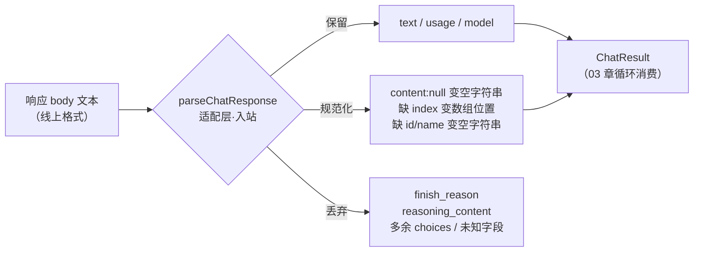

# 04.1 · 适配层：响应如何成为状态

> **本步问题**：响应 body（一段 JSON 文本）变成程序里的 `ChatResult` 时，哪些字段被保留、哪些被改写、哪些被悄悄丢弃？
> **前置**：02.1 工具请求的协议形状；03 章循环消费 `ChatResult.text / toolCalls` 的方式。
> **蓝图对应**：第 04 章 消息与协议（"模型输出怎样变成应用状态"第一刀：先看清现状转换，再决定改什么）。

## 1. 目标与可观察任务

- 不改代码。逐字段走读现有解析路径，产出一张三栏表：**保留（pass-through）/ 规范化（normalize）/ 丢弃（drop）**。
- 用三份手工改造的 fixture 离线回放验证预测——全部零费用。
- 完成后能观察到的现象：同一份响应，"线上 JSON 里有的"和"程序状态里有的"不再被当作一回事；规范化和丢弃集中发生在一个地方。

## 2. 原理与执行轨迹

新术语：**适配层**（adapter）——线上格式（wire format，服务器发什么就是什么）与程序内部表示（`ChatResult` / `ChatMessage`，代码指望它长什么样）之间的翻译层。本 Harness 里它是两个方向相反的函数：

- 入站：`parseChatResponse`（响应 JSON → `ChatResult`）
- 出站：`toWireMessage`（`ChatMessage` → 请求 JSON）

为什么需要它：协议字段可能缺失、为 `null`、带多余字段；下游代码（03 章的循环）不想处处判空。规范化集中在适配层做，代价是：**改写与丢弃只发生在这里，不在这里就没人知道它发生过**。

类比（适用边界）：像机场的入境检查——护照（字段）不齐的可以补录（规范化），违禁品（用不上的字段）直接没收（丢弃）。边界：入境检查会开收据，我们的适配层目前**不开收据**——丢了什么没有记录。



现状字段处理表（真实响应里已存在的字段，`fixtures/ch03/multitool.json` 可对照）：

| 线上字段 | 现状处理 | 代码位置 |
|---|---|---|
| `choices[0].message.content`（字符串） | 保留为 `text` | `src/model.ts:141` |
| `choices[0].message.content = null` | 规范化为 `""`（有工具调用时） | `src/model.ts:136,141` |
| `tool_calls[k].id / name / arguments` 缺失或非字符串 | 规范化为 `""` | `src/model.ts:177-179` |
| `tool_calls[k].index` 缺失 | 规范化为数组位置 | `src/model.ts:180` |
| `choices[1..]`（多余选择） | 丢弃 | `src/model.ts:134`（只取 `[0]`） |
| `finish_reason`、`reasoning_content`、`logprobs`、`cost` 等 | 丢弃 | 从未读取 |
| `usage.*` 缺失 | 保留为 `undefined`，显示 `?` | `src/model.ts:144-148` |

## 3. 实现与差异导读

本步不改代码，只走读三个入口：

- `src/model.ts:123` `parseChatResponse` 主流程：HTTP 状态 → JSON 解析 → 取 `choices[0].message` → 产出 `ChatResult`。
- `src/model.ts:174` `readToolCalls`：所有"字段缺失填默认值"的规范化都集中在这里。
- `src/model.ts:154` `toWireMessage`：出站方向（03 章回填时用），注意它做反向规范化——`argumentsText` 原样塞回 `arguments` 字符串。

## 4. 验证

三份手术 fixture（以真实录制 `fixtures/ch03/multitool.json` 为底**手工改造**，非真实录制，均离线回放）：

- `fixtures/ch04/surgery-content-null.json`：`message.content` 改为 `null`（`tool_calls` 保留）——有些提供商实际就这么发。
- `fixtures/ch04/surgery-no-id.json`：第一个 `tool_call` 删掉 `id` 字段。
- `fixtures/ch04/surgery-extra-field.json`：`message` 下加一个协议里不存在的字段。

```bash
node src/cli.ts replay fixtures/ch04/surgery-content-null.json   # 离线回放
node src/cli.ts replay fixtures/ch04/surgery-no-id.json          # 离线回放
node src/cli.ts replay fixtures/ch04/surgery-extra-field.json    # 离线回放
```

**预测题**：三份里几份能跑通（退出码 0）？一句话理由。

失败路径：`surgery-no-id` 的连锁反应——回放能过，但如果这个空 `id` 进入真实循环的回填消息（`tool_call_id: ""`），会发生什么？联系 03.3 的 id 配对实验（`fixtures/ch03/multitool-reversed.json`、`fixtures/ch03/orphan-tool.json`）。

## 5. 验证记录（课后回填）

**三份手术回放（2026-09-15，离线）**：全部退出码 0。

| 手术 | 可观察现象 |
|---|---|
| `surgery-content-null` | "回答"一节消失（`text` 变 `""`），工具调用照常列出 |
| `surgery-no-id` | 第一个工具显示 `id=`（空字符串） |
| `surgery-extra-field` | 协议外字段哪里都不出现——静默丢弃 |

学习者预测"两份能跑通"，实测三份全过——落差点：解析层对缺 `id` 没有任何拒绝路径（`src/model.ts:177` 填 `""` 了事）。

**失败路径连锁实验（真实调用，各一次）**：

1. 空 id 回填（`scripts/empty-id-roundtrip.ts` → `fixtures/ch04/empty-id-roundtrip.json`）：HTTP 400，服务端报错为"thinking 模式必须传回 `reasoning_content`"。
2. 单变量对照（`scripts/valid-id-roundtrip.ts` → `fixtures/ch04/valid-id-roundtrip.json`，仅 id 换正常值）：同样的 400、同样的措辞。学习者预测（对照仍 400）命中。
3. 离线变量排除：空 content 由 `fixtures/ch03/loop-multistep-round2.json`、`fixtures/ch03/loop-multistep-round3.json` 的 200 排除（这两例同样未回传 `reasoning_content`）；问题文本各例不同而结果一致。

**从证据能下的结论（边界要划清）**：

- 空 id 不是两次 400 之间的差异变量；**空 id 的真实回填后果在本环境未测定**——请求先被 `reasoning_content` 校验拒绝，id 校验是否会发生无从观察。
- 本环境出现了要求回传 `reasoning_content` 的 400，而 03 章六次同样不回传都 200；触发条件**未归因**（候选：会话级差异 / 提供商行为变化 / 实验脚本未带 `tools` 字段）。服务端报错与该要求的真实性未经服务端侧证实，不做更深归因。
- 实验设计教训：实验脚本与真实循环差一个 `tools` 字段，单变量控制不完整——实验前先把脚本与真实路径的出入列全。
- 结构性事实（与归因无关）：`ChatMessage` 没有 `reasoning_content` 字段，即使想回传也无从发起 → 进入 04.3 分级表与 04.4 协议对照的素材。

## 6. 小结

适配层是线上格式与程序状态之间唯一的翻译关口：它目前的策略是全容忍——改写与丢弃都无声。**回放能过不代表循环能跑**：回放只走解析路径，服务端校验触达不到（空 id 的真实后果本次就因另一层 400 而未测定）。下一小步 04.2 看丢弃清单里最危险的一项：`finish_reason`——它声明响应是否被截断，而我们现在根本不读它。
