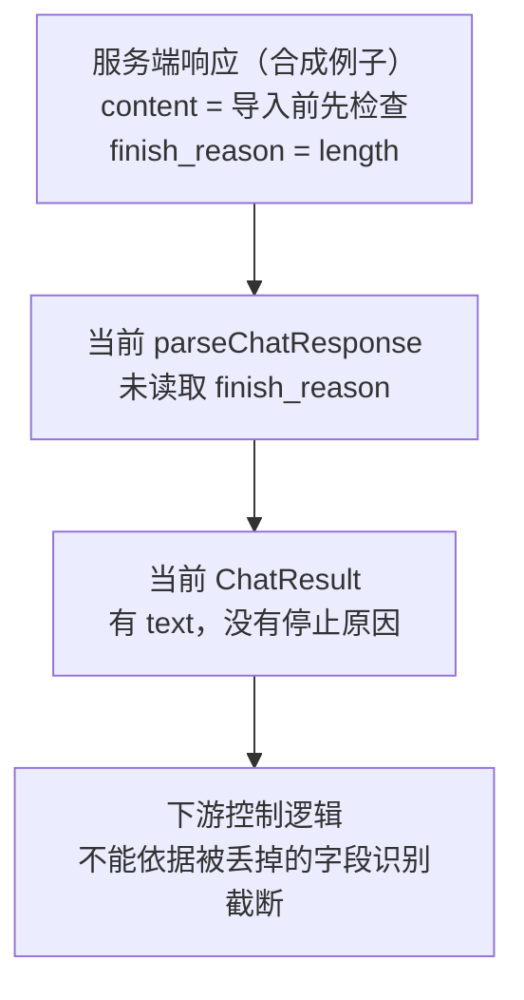
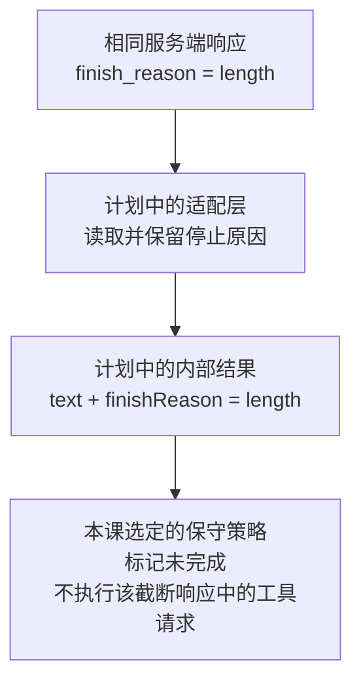

# 04.2 · 回答停止了，为什么还不能当成成功？

> 状态：重新备课；本页没有声称已实现 04.2 或获得新运行证据。
> 为什么学：避免截断输出或截断的行动建议被当成可靠结果继续使用。
> 目标：能根据停止信号与校验/任务证据，指出哪些结论还不能下。
> 连接：04.1 的字段保留/丢弃 → 本步识别截断 → 04.3 的校验分级。
> 阅读范围：导师先带读第 1 节，图 1 与图 2 依次讲，不同时分发整章。数据流不清时先用[桥接课](../bridge-01-04.md)的相关片段。

## 1. 先完整示范一次判断

以下是**合成示意**，不是新录制：

```json
{"message":{"content":"导入前先检查"},"finish_reason":"length"}
```

先看文字：它是一段字符串，程序能打印出来。再看停止信号：服务端报告本轮生成受长度限制而结束。能打印、HTTP 成功、外层 JSON 能解析，都不足以把这段内容当成完成任务的证据。

关键不是猜它原本想说什么，而是保留“不完整”的信号，让后续代码按明确策略处理。当前 `src/model.ts` 的 `ChatResult` 和 `parseChatResponse` 未保留 `finish_reason`；因此下游代码没有这个字段可用。本步计划修复这一信息丢失，而不是研究服务端内部推理。

### 图 1 · 当前：有信号，但没有传下去

**看图目的：** 追踪 `finish_reason` 在哪一步消失。箭头表示本课关注的数据如何流向下游，框内只列相关字段，省略用量等其他字段。此图是当前代码的静态概括，不是新实验截图。



**导师带读：** 先指第一框的停止原因，再指第三框：正文留下了，停止原因没有留下。图中第二框对应 `src/model.ts` 的解析路径，最后一框对应消费 `ChatResult` 的下游代码。这里不是说下游什么检查都没有，而是说这条特定的判断依据丢了。

### 图 2 · 本步计划：保留信号，再执行明确策略

下面仍是同一个输入，只改变字段的保留与处理。**这是计划设计图，尚未实现，不是运行证据。** 先让学习者看懂图 1，再展示这张对照图。



**对照结论：** 不是换一个更通顺的回答，而是让下游拿到需要的证据。`length` 路径先按本课保守策略处理；其他值仍要按协议及任务要求检查，图没有把“不是 length”画成“任务成功”。策略不是所有产品唯一可行的选择。

两图中的合成正文和字段与上方例子一致。真实验证时再把同一字段在 fixture、内部类型、输出中的位置一一对应，不用无关的终端全屏截图代替解释。

**finish_reason（生成停止原因）不等于任务结果。** 以 OpenAI Chat Completions 文档为协议参考，实际提供商仍须单独核对：

| 值 | 表达的信号 | 不能据此认定 |
|---|---|---|
| `stop` | 自然停止或命中指定停止序列 | 回答完整正确、需求已满足、文件已经修改 |
| `tool_calls` | 生成了工具调用请求 | 工具参数合法、已获授权、工具已经执行成功 |
| `length` | 达到生成长度限制 | 可把部分输出当正常完成；也不保证正文一定是半句话或参数一定是坏 JSON |
| 其他/缺失 | 按提供商协议进一步解释 | 不得静默归一为成功 |

外层响应 JSON、参数字符串是否可解析、参数是否符合 schema、动作是否允许、任务是否完成，是不同层次。这里先建立区别，完整校验在 04.3 和后续章节深化。

## 2. 现在只改一个条件

**为什么问：** 将来工具可能修改文件。即使一段行动参数“看起来合法”，也要判断还有什么证据缺失。

**已知条件：** `finish_reason` 为 `length`，其中的 `read_file` 参数恰好是合法 JSON。本步采用保守策略：整个响应被标为截断时不执行其中工具请求；可保留原文供诊断。暂不自动续写或重试。

**问题：** “JSON 解析成功，所以可以直接交给执行器”哪里不成立？可以沿图 2 指出仍要经过哪条判断，只需一处依据，不需要背字段或重画整图，也不需要预测供应商下一次会返回什么。

**需要帮助时：** 先沿图看“信息保留”和“动作策略”的连接；再对比相同参数、不同停止信号；仍卡住则导师示范，并换一个同层次例子。这是有支持的练习，不能把看过图中结论后的复述记为独立迁移。

<details>
<summary>练习后对照：参考解释与边界</summary>

JSON 解析成功只说明语法可解析，不表示响应完整，也不代替工具契约与执行许可检查。在本题已给定策略下，截断状态要阻止执行这些请求。拒绝执行是本课的保守基线，不是所有产品唯一可行策略；其他系统可以设计有依据的部分接纳，但必须说明契约、边界和风险。

</details>

这是机制判断。以后讨论“停止、展示部分结果还是重试”属于设计题，须另给预算、是否有副作用、部分结果可否使用等约束，不要求新手在无条件时三选一。

## 3. 已有对照：先理解，再改实现

现有两个文件只用于解析路径对照：

```bash
node src/cli.ts replay fixtures/ch01/ask-success.json
node src/cli.ts replay fixtures/ch04/surgery-finish-length.json
```

第二份是从第一份手工修改停止字段得到的合成变体，不是真实截断录制。**它可以仍保留一整句通顺正文**，所以不能用它证明实际截断一定造成半句话。它用来隔离一个变量：解析器是否读取并传播停止原因。

在课堂执行前先检查文件与代码版本。导师说明要观察“输出是否区分停止原因”，不要求猜全部日志。当前源码没有保留该字段是静态事实；两条命令本次维护未重新运行，不能把预期写成实测。

回放不联网、不执行工具，不证明当前真实模型受何种长度参数影响，也不证明整个 Loop 的安全策略已生效。

## 4. 本步实现计划与验收

由 AI 在课堂中按理解进度实现，不在课程维护中提前写好答案工程。

- `src/model.ts`：保留停止原因；不要把未知/缺失值转为 `stop`。准确表示原始协议与内部状态，不用字段断言冒充运行时校验。
- `src/cli.ts`：先采用明确的保守基线，截断时显示未完成、不得走正常成功路径；截断工具请求不得送入执行器。本步不自动续写，避免同时引入重试策略。退出状态的约定要写清。
- 测试：同一正文、不同停止原因的解析对照；截断且参数恰好合法时不调用执行器；正常路径回归。后两类需要循环/调度路径的测试，不能只运行 `replay` 就宣布通过。测试文件在实现时按仓库现有结构建立。

验收区分：解析保留字段、调度遵守策略、真实任务结果，各自需要对应证据。学习者能解释检查的性质及边界，比背枚举值重要。

### 真实截断观察是可选补充

当前 CLI **尚未支持 `--max-tokens`**，发送请求也未传相应限制字段。不能直接照抄带这个参数的旧课件命令：当前解析方式可能把它留在问题文本中，并不能限制输出或费用。

先完成必要的参数支持并检查提供商官方文档，再决定是否真实调用。OpenAI 当前 Chat Completions 文档优先列出 `max_completion_tokens`，`max_tokens` 已标弃用且非所有模型兼容；其他提供商可能不同，不做统一假设。输出上限也不等于总费用上限。

真实调用前确定请求数、预算与停止条件，创建录制文件后登记 `fixtures/INDEX.md`。小上限不保证得到某个固定可见文本或错误形状；若出现无关鉴权/协议错误，只记录观察，不把排查供应商内部条件变成新主线。

## 5. 收口与下次复访

一句话结论：**生成停止的原因要保留下来，但任何单一停止信号都不证明真实任务完成。**

下次进入 04.3 时，用一个正常 `stop` 但结构或任务结果不符合要求的变体，复访“停止与有效”的区别；根据实际回答调整支持程度，不在此预记已掌握。

## 6. 验证记录

本次：备课、图文静态审阅与既有源码核对。两张图分别说明当前代码和未来计划；04.2 代码尚未在本次维护中实现，上述命令未重新实跑，无新增真实调用或学习者回答。图的实际渲染检查与课堂使用反馈另据实记录，不能由存在 Mermaid 图源推定已验证。

课堂后回填代码版本、实际命令、输出、证据路径和限制。个人判断另进短复习卡。

协议参考（2026-09-16 查阅）：[OpenAI Chat Completions API](https://developers.openai.com/api/reference/resources/chat/subresources/completions/methods/create)。它是对照来源，不等于当前第三方提供商的行为保证。
